# Linda Vendas - ODS 8 (Cruzeiro do Sul)

<p align="center">
  
</p>

<p align="center">
  <strong>The Ultimate Sales & Inventory Powerhouse for Small Entrepreneurs</strong>
</p>

<p align="center">
  
  
  
  
  
</p>

---

## 📌 Comprehensive Overview

**Linda Vendas** is a state-of-the-art mobile solution built to revolutionize how micro-entrepreneurs manage their business. Developed under the **ODS 8 initiative** at **Cruzeiro do Sul University**, it combines enterprise-grade features with an incredibly simple user interface.

### 🌍 ODS 8: Decent Work and Economic Growth

This app is more than a tool; it's an economic catalyst:

- **Financial Empowerment:** Accurate profit tracking and loss prevention.
- **Innovation:** Bringing high-end tech to local street markets and small shops.
- **Formalization:** Helping businesses organize data for future growth and credit access.

---

## 🏗️ System Architecture & Logic

### 📊 Database Schema (ERD)

The following diagram illustrates how the data is structured within Supabase:

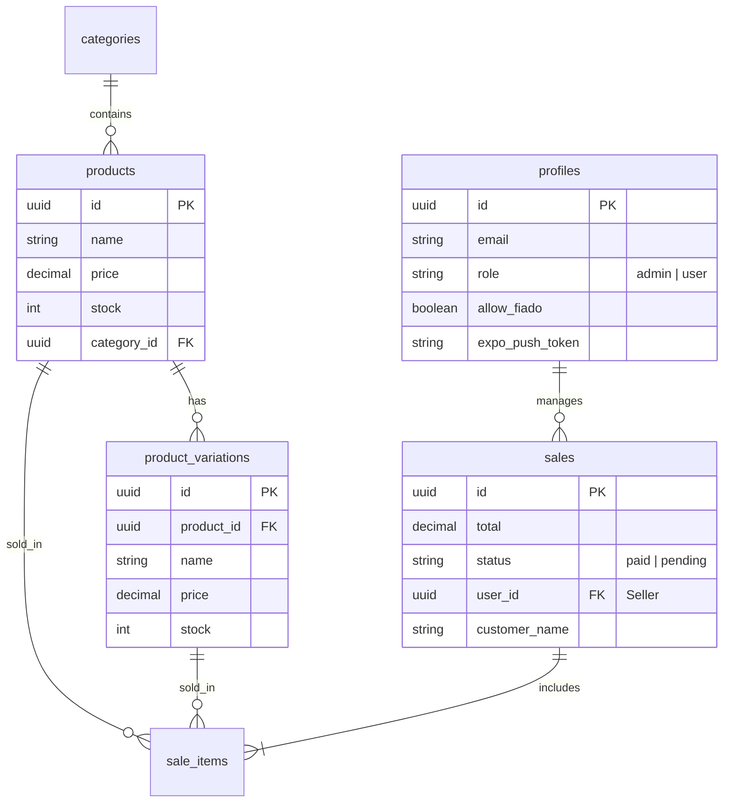

### 🔐 Role-Based Access Control (RBAC) Flow

How the application decides what the user can see and do:

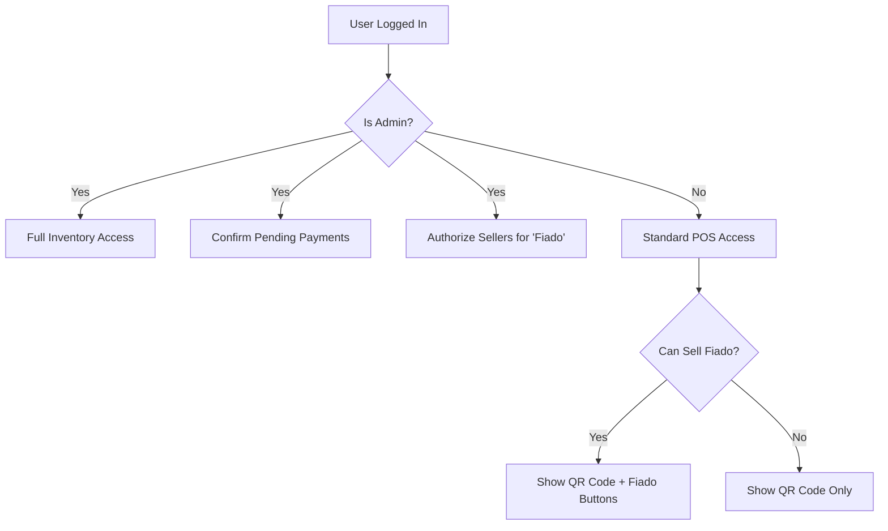

---

## 🛡️ Business Rules & Access Control

### 👤 Seller Role (Standard)

- **Dynamic POS Operations:** Create sales and select products.
- **Conditional "Fiado" Sales:** The "Fiado" (Pending Payment) option only appears if the **Admin explicitly authorizes** it for that specific seller. Otherwise, only the QR Code (Instant Payment) option is available.
- **Personal History:** View their own sales performance and history.
- **Read-Only Inventory:** Browse products without modification rights.

### 👑 Admin Role (Manager)

- **Total Inventory Control:** Full rights to manage products, variations, and categories.
- **Seller Authorization:** Grant or revoke "Fiado" sales permission for each seller individually.
- **Financial Validation:** Review and **manually confirm** pending "Fiado" payments.
- **Global Analytics:** Access consolidated data and seller-specific metrics.

---

## ✨ Specialized Technical Features

### 🌓 Intelligent Dark Mode

The app features a seamless theme transition using **NativeWind**. Every component is optimized for high contrast and readability in both Light and Dark modes.

### 🔔 Smart Notification System (Expo Notifications)

Integrated with **Expo Push Notifications**, the app keeps the business owner informed in real-time about sales and inventory levels.

### 💸 Professional Payment & Credit Flows

- **Instant Pix (BRCode):** Automated QR Code generation with CRC16 checksum for error-free transactions.
- **Permission-Based Credit (Fiado):** A trust-based system where the Admin controls credit sales.

---

## 📱 Visual Experience (Full Gallery)

### 🌓 Theme & Onboarding

|                     **Google Secure Login**                     |                 **Dashboard (Light Mode)**                  |                      **Dashboard (Dark Mode)**                       |
| :-------------------------------------------------------------: | :---------------------------------------------------------: | :------------------------------------------------------------------: |
| 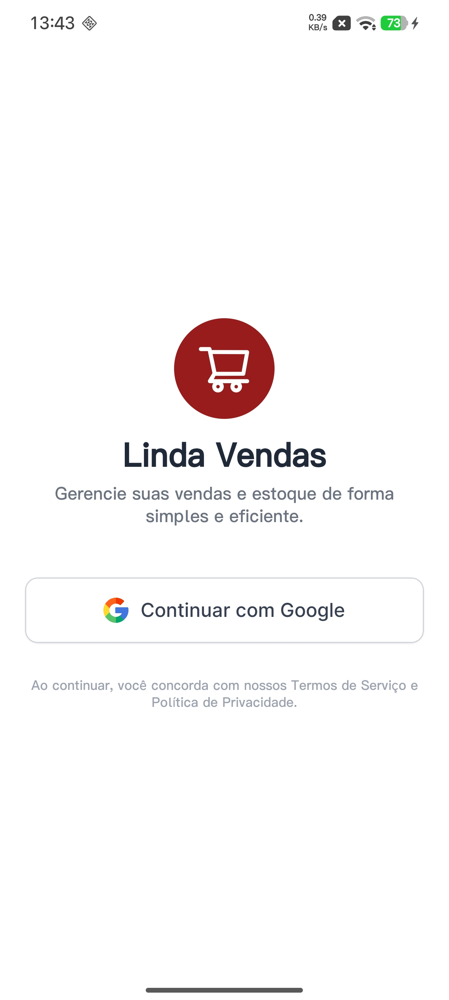 |  | 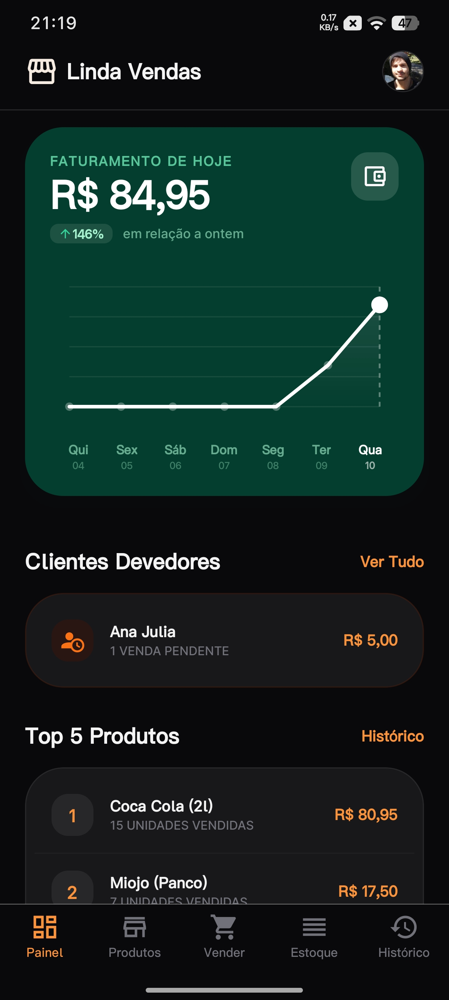 |
|            _OAuth integration for business safety._             |             _Clean interface for daytime use._              |                      _Eye-friendly dark theme._                      |

### 🛒 Point of Sale (POS) & Dynamic Rules

|                   **Dynamic Payment Options**                   |                          **Smart Checkout**                           |                        **Instant Pix Payment**                        |
| :-------------------------------------------------------------: | :-------------------------------------------------------------------: | :-------------------------------------------------------------------: |
| 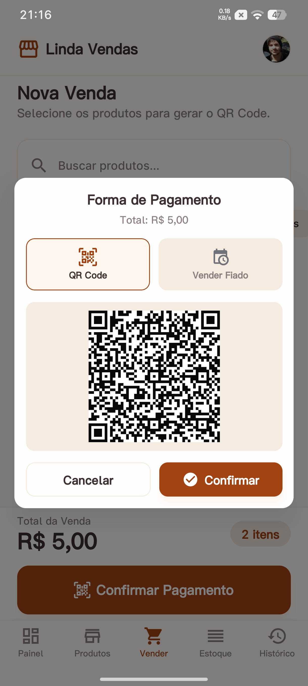 | 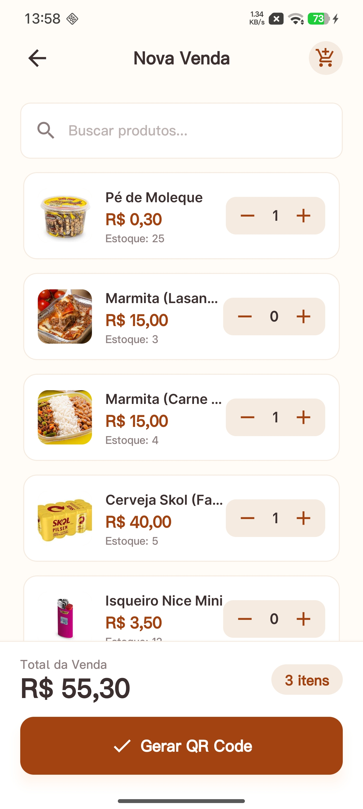 | 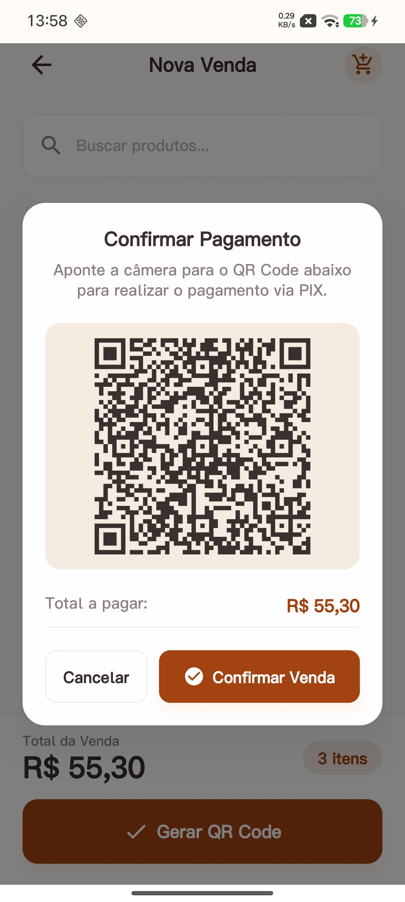 |
|         _"Fiado" only appears for authorized sellers._          |              _On-the-fly discounts & stock validation._               |                      _Static BRCode generation._                      |

### 📦 Inventory & Catalog Management

|                        **Product Price List**                         |                       **Product Variations**                       |                  **Inventory Control**                  |
| :-------------------------------------------------------------------: | :----------------------------------------------------------------: | :-----------------------------------------------------: |
|  | 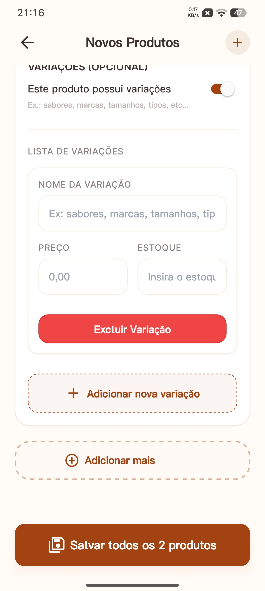 |  |
|                 _Quick price reference for sellers._                  |                _Sizes, colors, and types support._                 |             _Admin-only stock adjustments._             |

### 🛠️ Advanced Admin Operations

|                          **Single Product Entry**                          |                             **Bulk Stock Addition**                              |                            **Payment Confirmation**                             |
| :------------------------------------------------------------------------: | :------------------------------------------------------------------------------: | :-----------------------------------------------------------------------------: |
|  | 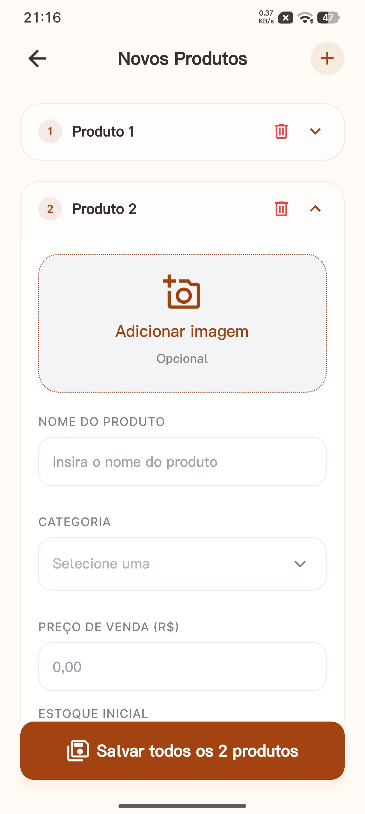 | 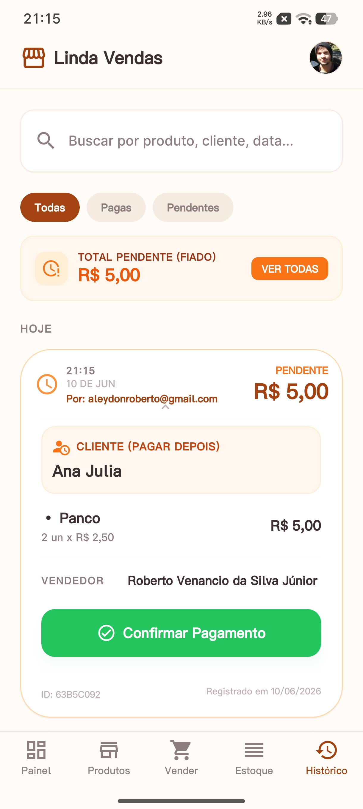 |
|                        _Detailed product creation._                        |                      _Efficient multiple-item restocking._                       |                      _Admin validation for "Fiado" sales._                      |

### 📊 Reports & User Preferences

|                    **Consolidated History**                     |                    **Profile & Sync Settings**                     |
| :-------------------------------------------------------------: | :----------------------------------------------------------------: |
|  | 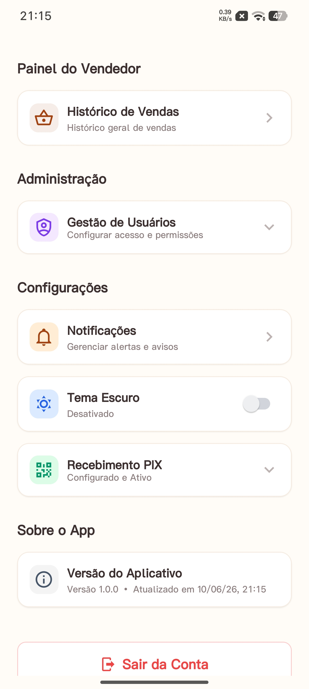 |
|          _Full audit trail for business transparency._          |             _Manage push tokens and app preferences._              |

---

## 🏗️ Production Deployment Guide

Follow these steps to deploy **Linda Vendas** for a new client or production environment.

### 1. Resetting EAS (Expo Application Services)

If you are cloning this repo for a new store, you must reset the project identity:

1. **Delete the `eas.json` file** and the `extra.eas.projectId` from `app.json`.
2. Run the configuration command: `npx eas build:configure`
3. Log in to your Expo account and follow the prompts.
4. **CRITICAL:** Update the new **Project ID** in `src/hooks/useNotifications.ts`.

### 2. Supabase Edge Functions (Real-time Alerts)

1. **Install Supabase CLI:** `npm install supabase --save-dev`
2. **Login & Link:** `npx supabase login` then `npx supabase link --project-ref your-project-id`
3. **Deploy the Function:** `npx supabase functions deploy vendas-estoque-push`
4. **Set Webhook:** In Supabase Dashboard, create a Webhook for the `sales` table (Insert/Update) pointing to your function URL.

### 3. Google OAuth & Firebase Console

1. **Firebase Configuration:**
   - Create a project and enable **Cloud Messaging**.
   - Download `google-services.json` and place it in the project **root**.
   - **CRITICAL (Secret Key):** Generate a **Service Account Key** (JSON) in Firebase Settings > Service Accounts.
   - **DO NOT** keep this secret key in the project root or commit it to Git. Keep it in a safe place on your machine.
2. **Google Cloud:** Create **Client IDs** for Web (Supabase) and Android/iOS (Expo).
3. **EAS CLI Build Process:** When running `eas build`, the terminal will ask for:
   - The `google-services.json` (it will find it automatically in the root).
   - **The FCM Server Key/Service Account Key:** When prompted, provide the path to that **secret JSON file** you saved safely. Choose **"Yes"** to upload it to Expo's secure servers. This is required for Push Notifications to work on Android.

---

## 🧪 Industrial-Strength Testing

This project maintains a high standard of quality through an extensive test suite:

- **Business Logic:** Hooks (`useCart`, `useDashboardMetrics`) are fully unit-tested.
- **API Integrity:** Mocked Supabase & Services layer.
- **User Interface:** Components (`ProductForm`, `SaleProductItem`) tested for interaction.

```bash
# Run all 50+ tests
npm test
```

---

## 🛠️ Tech Stack Details

- **Mobile Framework:** React Native 0.79 with Expo 53.
- **Backend-as-a-Service:** Supabase (Auth, DB, Realtime, Edge Functions).
- **Styling:** NativeWind (Tailwind CSS).
- **Navigation:** Expo Router (File-based routing).

---

<p align="center">
  <b>Developed for ODS 8 - Cruzeiro do Sul University</b><br/>
  <i>Empowering local commerce through technology.</i>
</p>
