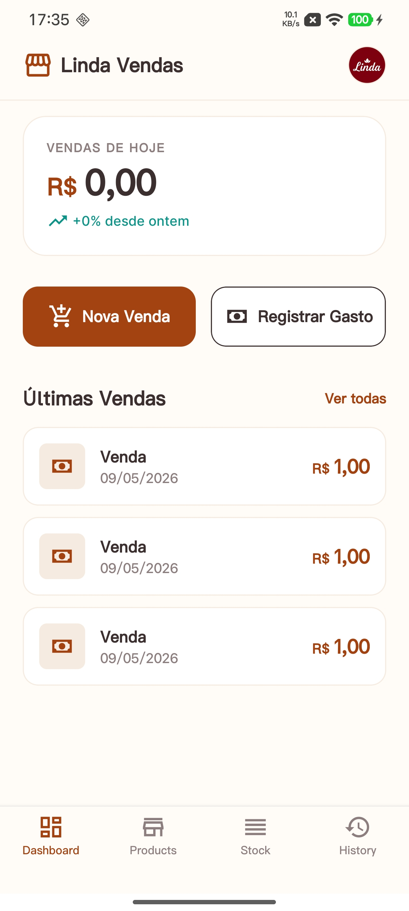
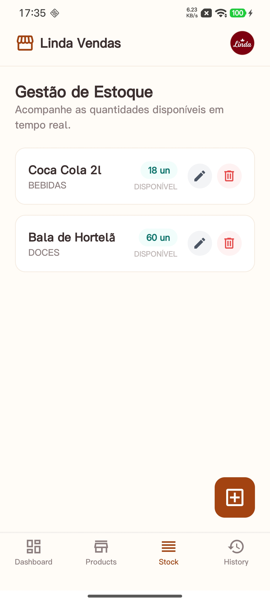
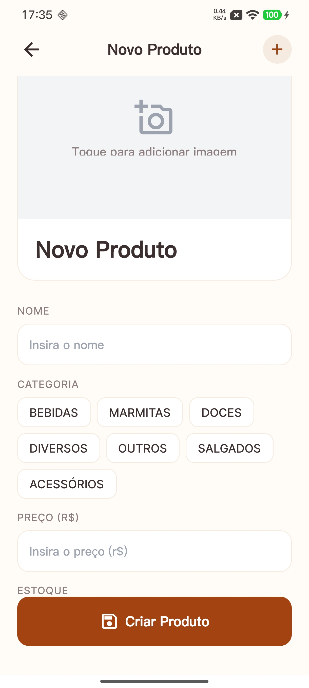
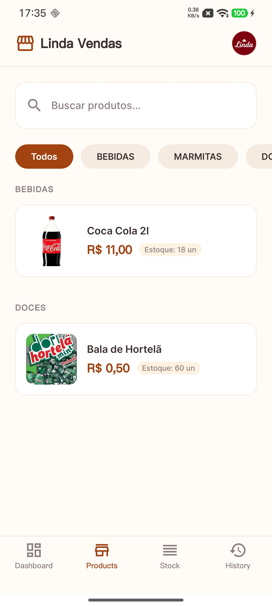
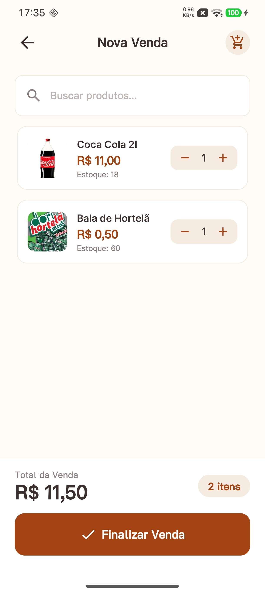
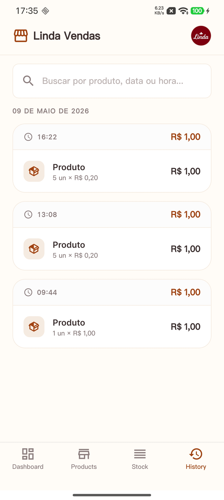

# Linda Vendas - ODS 8 (Cruzeiro do Sul)</div>

<p align="center">
  
</p>

## 📌 About the Project

**Linda Vendas** is a mobile application developed as part of the **ODS 8 (Sustainable Development Goal 8)** initiative at **Cruzeiro do Sul**. The project aims to empower micro and small entrepreneurs by providing a simple, efficient, and accessible tool for sales management and inventory control.

The application allows users to track their products, manage stock levels in real-time, and record sales transactions, helping them gain better control over their business operations and financial health.

---

## 🌍 ODS 8 Alignment: Decent Work and Economic Growth

The United Nations Sustainable Development Goal 8 aims to "promote sustained, inclusive and sustainable economic growth, full and productive employment and decent work for all."

**Linda Vendas** contributes directly to several ODS 8 targets:

- **Target 8.3 (Support MSMEs and Entrepreneurship):** By providing a free or low-cost digital management tool, the app supports the formalization and growth of micro, small, and medium-sized enterprises (MSMEs). It helps entrepreneurs organize their business, which is a crucial step toward sustainability and economic expansion.
- **Target 8.2 (Economic Productivity through Innovation):** The project promotes technological upgrading by introducing digital tools to traditional or manual sales processes, increasing the productivity of small business owners.
- **Economic Empowerment:** Proper inventory and sales management reduce waste and financial loss, directly impacting the income stability and growth potential of independent workers and small teams.

---

## ✨ Key Features

- **Inventory Management:** Add, edit, and delete products with category support.
- **Real-time Stock Tracking:** Automatic stock updates after sales and manual stock adjustments.
- **Sales Recording:** Quick sale process with automated total calculation.
- **Sales History:** Access historical data to analyze business performance.
- **Dashboard:** At-a-glance view of business metrics (Current Stock, Recent Sales).
- **Search & Filtering:** Easily find products by name or category.
- **Offline-First Ready:** Built with local state management for a smooth user experience.

---

## 📱 Screenshots

Discover how **Linda Vendas** empowers entrepreneurs through its intuitive interface:

|                                                  **Dashboard**                                                   |                                            **Stock Management**                                             |
| :--------------------------------------------------------------------------------------------------------------: | :---------------------------------------------------------------------------------------------------------: |
|                                       |                               |
| _Central control panel providing at-a-glance metrics on sales and stock levels, enabling data-driven decisions._ | _Real-time monitoring of inventory to prevent stockouts and manage resources effectively (**Target 8.2**)._ |

|                                             **Add New Product**                                              |                                     **Product Price List**                                     |
| :----------------------------------------------------------------------------------------------------------: | :--------------------------------------------------------------------------------------------: |
|              |  |
| _Simplified interface for digitizing inventory, lowering the barrier to formal management (**Target 8.3**)._ | _Consolidated view of the product catalog, facilitating quick reference and inventory audits._ |

|                                  **Dynamic Sales & Pricing**                                   |                                              **Sales History**                                              |
| :--------------------------------------------------------------------------------------------: | :---------------------------------------------------------------------------------------------------------: |
|       |                          |
| _Flexible sales recording process that accommodates the fluid nature of small-scale commerce._ | _Historical record of transactions, allowing business owners to track progress and identify growth trends._ |

---

## 🛠 Tech Stack

- **Framework:** [React Native](https://reactnative.dev/) with [Expo](https://expo.dev/)
- **Navigation:** [Expo Router](https://docs.expo.dev/router/introduction/) (File-based routing)
- **Styling:** [NativeWind](https://www.nativewind.dev/) (Tailwind CSS for React Native)
- **Backend/Database:** [Supabase](https://supabase.com/) (PostgreSQL + Auth + Storage)
- **State Management:** React Context API
- **Icons:** Expo Vector Icons (Material Community Icons)
- **Linting & Formatting:** ESLint, Prettier, CommitLint

---

## 🚀 Getting Started

### Prerequisites

- [Node.js](https://nodejs.org/) (v18 or newer)
- [npm](https://www.npmjs.com/) or [bun](https://bun.sh/)
- [Expo Go](https://expo.dev/expo-go) app on your physical device or an Android/iOS emulator.

### Installation

1. **Clone the repository:**

   ```bash
   git clone https://github.com/Aleydon/ODS-8.git
   cd Linda-Sales-Cruzeiro-do-Sul-ODS
   ```

2. **Install dependencies:**

   ```bash
   npm install
   # or
   bun install
   ```

3. **Environment Variables:**
   Create a `.env` file in the root directory (using `.env.example` as a template) and add your Supabase credentials:

   ```env
   EXPO_PUBLIC_SUPABASE_URL=your_supabase_url
   EXPO_PUBLIC_SUPABASE_ANON_KEY=your_supabase_anon_key
   ```

4. **Start the application:**
   ```bash
   npm start
   ```

---

## 📁 Project Structure

```text
src/
├── app/               # Expo Router routes (tabs and screens)
├── assets/            # Static assets (images, fonts)
├── components/        # Reusable UI components
├── context/           # Global state management (AppContext)
├── lib/               # Third-party configurations (Supabase client)
├── services/          # API services and data fetching logic
├── utils/             # Helper functions and formatters
└── __tests__/         # Unit and integration tests
```

---

## 🤝 Contributing

This is an academic project for **Cruzeiro do Sul**. Contributions that align with the ODS 8 mission are welcome.

1. Fork the project.
2. Create your feature branch (`git checkout -b feature/AmazingFeature`).
3. Commit your changes using Conventional Commits (`npm run commit`).
4. Push to the branch (`git push origin feature/AmazingFeature`).
5. Open a Pull Request.

---

## 📝 License

This project is licensed under the MIT License - see the LICENSE file for details.

---

<p align="center">Developed for ODS 8 - Cruzeiro do Sul University</p>
